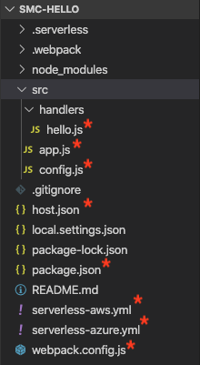

# Serverless Multicloud Library Readme

## Introduction

The Serverless Multicloud Library is an abstraction that enables writing one unified serverless codebase that works on both Azure Functions and AWS Lambda Functions. When used in conjunction with the Serverless Framework, you have a working CI/CD environment that allows one codebase to be deployed to - and function on - both cloud platforms.

This readme will help the reader setup a `hello` serverless function  that works on both Azure and AWS, using the Serverless Framework to provide the DevOps aspects such as local testing and deployment to both clouds, and the Serverless Multicloud Library to provide a normalized API that supports serverless functions for both Azure and AWS.

## Prerequisites for this implementation

1. Node.js 10.x
2. [Serverless Framework CLI v.1.9.0+](https://serverless.com/)  
   
   You can set up from the command line:

``` Shell
    npm i -g serverless
```

3. Set up provider credentials:

    a. For [AWS](https://github.com/serverless/serverless/blob/HEAD/docs/providers/aws/guide/credentials.md), or [watch video](https://www.youtube.com/watch?v=HSd9uYj2LJA)  
    b. For [Azure](https://serverless.com/framework/docs/providers/azure/guide/credentials/)

## Setup

The following procedures are designed to allow you to open the sample code package and use it to create the following:

* Set up a project for a multi-cloud serverless application
* A local test environment for Azure serverless deployment
* A local test environment for AWS serverless deployment
* Deployment to the Azure cloud platform's Azure Functions service
* Deployment to the AWS cloud platform's AWS Lambda service
* Use a common/normalized API to communicate with both deployed applications


**NOTE**: The approach we will take is to start with using the Serverless Framework to create an Azure Serverless project, then we will modify it so it will work with both Azure and AWS.

### Step 1

Start by using the Serverless Framework to create a serverless azure function based on the Azure functions template. In a command window, enter:

``` Shell
    sls create -t azure-nodejs -p smc-hello
```

Where `azure-nodejs` is the template name and `smc-hello` is the project name.

### Step 2

CD into the project folder:

``` Shell
    cd smc-hello/
```

You can see the following project folder structure:

```
smc-hello-+
          |
          |
          |-src
          |  |- handlers
          |         |- goodbye.js
          |         |- hello.js
          |
          README.md
          host.json
          package.json
          serverless.yml
```

Under the *src* folder is a subfolder called *handlers*. This is where the two handler files (`goodbye.js` and `hello.js`) for this project are expected by the Serverless Framework. The `serverless.yml` file is the configuration file used by the serverless framework to deploy the application. If you examine the `serverless.yml` file, you will see that it outlines 2 function endpoints, one for hello and the other for goodbye.

### Step 3

To make sure you have the latest version of the Azure Functions plugin, run:

``` Shell
    npm install serverless-azure-functions --save
```

This will add a new folder *node_modules* under the root of the project.

### Step 4

At this point you can test the 2 servereless functions locally. To do so, first run:

``` Shell
      sls offline
```

Once this process is complete, you will be provided with 2 endpoints for the 2 handlers:

``` Shell
    * goodbye:  [GET]  http://localhost:7071/api/goodbye
    * hello:  [GET]  http://localhost:7071api/hello
```

### Step 5

To test this, you can use either your browser or a tool such as *Postman*, *cURL*, or a similar tool. Using this tool, you can send the following `GET` request to the endpoint for the goodbye handler function:

``` Shell
    http://localhost:7071/api/hello?name=Tony
```

This should get the following response:

``` Shell
    Hello Tony
```

Repeat the request for the hello handler function:

``` Shell
    http://localhost:7071/api/goodbye?name=Cindy
```

This should get the following response:

``` Shell
    Goodbye Cindy
```

At this point we know the code works with Azure. The next task is to make this a project with unified code that works on both AWS and Azure. It is here where we will using the Serverless Multicloud Library.

### Step 6

Go back to the project folder and delete the following files:

```
    serverless.yml
    host.json
    src/handlers/goodbye.js
    src/handlers/hello.js
```

### Step 7

Create the following 8 files at the indicate locations. They are indicated by the asterisk next to each file. Please note that we will have 2 serverless yaml files; one for each cloud provider.



### Step 8

Paste the code into each the respective files:

* _host.json_ (in the root of the project)

``` json
{
  "version": "2.0"
}
```

* _serverless-aws.yml_ (root)

``` YAML
service: smc-hello
provider:
  name: aws
  runtime: nodejs10.x

plugins:
  - serverless-offline
  - serverless-webpack

functions:
  hello:
    handler: src/handlers/hello.sayHello
    events:
      - http:
          path: /hello
          method: get
```

* _serverless-azure.yml_

```YAML
service: smc-hello

provider:
  name: azure
  region: West US 2
  runtime: nodejs10.x

  environment: # these will be created as application settings
    VARIABLE_FOO: 'foo'

plugins: # look for additional plugins in the community plugins repo: https://github.com/serverless/plugins
  - serverless-azure-functions

# you can add packaging information here
package:
  # include:
  #   - include-me.js
  #   - include-me-dir/**
  exclude:
    # - exclude-me.js
    # - exclude-me-dir/**
    - local.settings.json
    - .vscode/**

functions:
  hello:
    handler: src/handlers/hello.sayHello
    events:
      - http: true
        x-azure-settings:
          methods:
            - GET
          authLevel: anonymous # can also be `function` or `admin`
```

* package.json --> smc-hello (root)

``` json
{
  "name": "smc-hello",
  "version": "1.0.0",
  "description": "Multicloud Functions sample for the Serverless framework",
  "scripts": {
    "test": "echo \"No tests yet...\"",
    "start": "npm run start:azure",
    "start:azure": "sls offline --config serverless-azure.yml",
    "start:aws": "sls offline --config serverless-aws.yml",
    "pack": "webpack",
    "deploy": "npm run deploy:azure && npm run deploy:aws",
    "deploy:aws": "sls deploy --config serverless-aws.yml",
    "deploy:azure": "sls deploy --config serverless-azure.yml",
    "update:multicloud:latest": "npm install @multicloud/sls-core@latest @multicloud/sls-azure@latest @multicloud/sls-aws@latest --save",
    "update:multicloud:beta": "npm install @multicloud/sls-core@beta @multicloud/sls-azure@beta @multicloud/sls-aws@beta --save"
  },
  "keywords": [
    "azure",
    "aws",
    "serverless"
  ],
  "dependencies": {
    "@multicloud/sls-aws": "^0.1.1",
    "@multicloud/sls-azure": "^0.1.1",
    "@multicloud/sls-core": "^0.1.1"
  },
  "devDependencies": {
    "serverless-azure-functions": "^1.0.2",
    "serverless-offline": "^5.12.0",
    "serverless-webpack": "^5.3.1",
    "webpack": "^4.41.2",
    "webpack-cli": "^3.3.10"
  }
}
```

* webpack.config.js --> smc-hello (root)

``` javascript
const path = require('path');
const slsw = require('serverless-webpack');

module.exports = {
  entry: slsw.lib.entries,
  target: 'node',
  output: {
    libraryTarget: 'commonjs2',
    library: 'index',
    path: path.resolve(__dirname, '.webpack'),
    filename: '[name].js'
  },
  plugins: [],
};
```

* app.js --> /src

``` javascript
const { App } = require("@multicloud/sls-core");
const { AzureModule } = require("@multicloud/sls-azure");
const { AwsModule } = require("@multicloud/sls-aws");

module.exports = new App(new AzureModule(), new AwsModule());
```

* config.js --> /src

``` javascript
const {
    LoggingServiceMiddleware,
    HTTPBindingMiddleware,
    PerformanceMiddleware,
    ExceptionMiddleware,
    ConsoleLogger,
    LogLevel,
  } = require("@multicloud/sls-core");
  
  const defaultLogger = new ConsoleLogger(LogLevel.VERBOSE);
  
  module.exports = function config() {
    return [
      LoggingServiceMiddleware(defaultLogger),
      PerformanceMiddleware(),
      ExceptionMiddleware({ log: defaultLogger.error }),
      HTTPBindingMiddleware()
    ];
  };
```

* hello.js --> /src/handlers/

``` javascript
const app = require("../app");
const middlewares = require("../config")();
const package = require("../../package.json");

module.exports = {
    sayHello: app.use(middlewares, (context) => {
        const { req } = context;
        const name = req.query.get("name");

        if (name) {
          context.send(`Hello ${name}`, 200);
        }
        else {
          context.send("Please pass a name on the query string or in the request body", 400);
        }
    })
  };
```

Some things to note about these files:

* The `hello.js` handler file is a bit different than the original as it includes support for the multicloud library and the associated middleware that makes the normalization of the APIs possible. You can compare the source for each file to see the differences.
* The `serverless-azure.yml` file is very similar to the original `serverless.yml` file except that the reference to the handler points to the new handler (`hello.sayhello`)
* The `serverless-aws.yml` file is similar to the `serverless-azure.yml` file, but for the packaging and testing but it lists 2 additonal plugins. The syntax for defining the hello endpoint is also slightly different based on AWS Lambda requirements.
* The `package.json` file now specifies the multicloud library to normalize the API for both cloud platforms and has a number of commands that help with making the local testing and deployment easier.
* The `host.json` file is where the dependencies on the multicloud library are listed.
* The file `app.js` is the dependencies on the Serverless Multicloud Library are listed and the _module.exports_ that would instantiate a new App.
* The file `config.js` is used to support registration of the middleware.
* The `hello.js` file is the actual handler for all requests and the code reflects the normalization of the APIs in addition to listing the dependencies on the middleware provided by the Serverless Multicloud Library.

### Step 9

Since we have changed the composition of the project and added more dependencies, let's do an npm install. Enter the following from the command window so the additional libraries (including the *Serverless Multicloud Library*) are added to the project:

``` Shell
    npm install
```

**NOTE**: If you get a request to *fund* your package, ignore it.

### Step 10

We can now test invoking the azure function locally. Enter the following in the command window:

``` Shell
    npm run start:azure
```

After the start sequence is complete, you will will see the *hello* endpoint as being listened to at:

``` Shell
    Http Functions:
       hello: [GET] http://localhost:7071/api/hello
````

To confirm that things are working as intended, use your API client tool to send the following GET request:

```
    http://localhost:7071/api/hello
```

Because the request did not include a value for *name*, an error message is returned:

``` Shell
    Please pass a name on the query string or in the request body.
```

Now, send the following:

``` Shell
    http://localhost:7071/api/hello?name=Maria
```

If everything is working, you should get the response:

``` Shell
    Hello Maria
```

### Step 11

Now we can repeat the process for AWS. Begin by running the following from a new command window (keep the other one open):

``` Shell
    npm run start:aws
```

When the start process is complete, you should note a message something like the following:

``` Shell
    Offline [HTTP] listening on http://localhost:3000
```

To confirm that things are working as intended, use your API client tool to send the following `GET` request:

``` Shell
    http://localhost:3000/api/hello?Fady
```

If everything is working, you should get the response:

``` Shell
    Hello Fady
```

So, we have run the code for testing locally on Azure and on AWS and seen that the same API call works on both platforms.

Now we need to try them on the live cloud platforms.

### Step 12

Stop both local servers by using a CTRL+C command in each of the 2 command windows.

**NOTE**: As noted at the beginning, we assume that you have set up credentials for both *AWS* and *Azure*. That is necessary for the following steps to work. Also, you can notice in the *yaml* files, we have predefined the region, and other deployment parameters per cloud provider. These are some of the aspects that can be predefined in the `serverless-xxx.yml` files which are aspects of what the Serverless Framework provides.

### Step 13

Deploy to Azure. Run the following command from the command window which we used for Azure:

``` Shell
    npm run deploy:azure
```

When the deployment is done, a message like the following is returned:
Deployed serverless functions:

``` Shell
    -> Hello: sls-wus2-dev-smc-hello.azurewesites.net/api/hello
```

This is the endpoint for the hello handler function on Azure. You can use your API client tool to send the following GET request:

``` Shell
    sls-wus2-dev-smc-hello.azurewesites.net/api/hello?name=Tina
```

Which should get the response:

``` Shell
    Hello Tina
```

### Step 14

Deploy to AWS. Run the following command from the command window we used for AWS earlier:

``` Shell
    npm run deploy:aws
```

When the deployment is done, a message like the following is returned:

``` Shell
    endpoints:
      GET - https://25usdrthf8.execute-api.us-east-1.amazonaws.comdev/hello
    functions:
      hello: smc-hello-dev-hello
```

Use you API client tool to send the following GET request:

``` Shell
    https://25usdrthf8.execute-api.us-east-1.amazonaws.comdev/hello?name=Robert
```

Which should get the response:

``` Shell
    Hello Robert
```

## Conclusions

From this demo you should have learned the following:

* It is possible to deploy the same code to two cloud platforms and interface with both using the same API. This is accomplished with the *Serverless Multicloud Library*.
* The serverless framework provides a streamlined means to deploy to both cloud platforms and takes care of the different details required by each cloud platform.
* This process fits well into a CI/CD process suitable for meeting DevOps or GitOps requirements.
* This solution provides a way out of *vendor lock-in* and enabling a best of breed solution.
* Higher availability is enabled where with an active-active setup and where if one cloud platform has an outage, the calls can be routed to the other cloud provider.
* You can save money by optimizing for cost between the two cloud platforms and balance the load accrodingly.
* Development costs are reduced in creating serverless applications because you can focus on the individual app functions and less time on the supporting infrastructure. Experience shows a 40-60+% cost savings here.

## Related Materials

See any of the following materials for additional information:

* CSE One-Page Description
* CSE White Paper
* CSE Reference Architecture
* [Serverless Framework](https://serverless.com/)

## Contributions

We enthusiastically welcome contributions and feedback. Please read the [contribution guidelines](https://github.com/serverless/multicloud/blob/master/CONTRIBUTING.md) before you begin.

## Code of Conduct

This project has adopted the [Microsoft Open Source Code of Conduct](https://opensource.microsoft.com/codeofconduct/). For more information see the [Code of Conduct FAQ](https://opensource.microsoft.com/codeofconduct/faq/) or contact [opencode@microsoft.com](omailto:pencode@microsoft.com) with any additional questions or comments.

## License

Copyright (c) Microsoft Corporation. All rights reserved. Licensed under the MIT License (the "[License](https://github.com/serverless/multicloud/blob/master/LICENSE.txt)").
